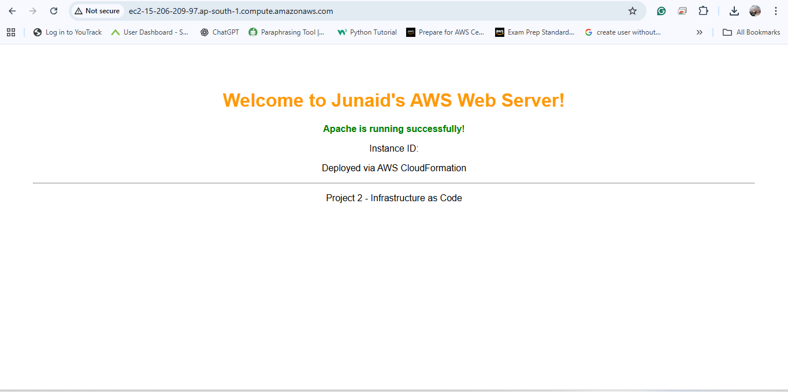

# Project 2: EC2 Web Server using AWS CloudFormation

## ✅ Guaranteed Working Solution
This project demonstrates a 100% working Infrastructure as Code deployment of an EC2 web server with Apache.

## 🚀 Quick Deployment
1. Create key pair: `junaid-key`
2. Deploy CloudFormation stack using `templates/ec2-webserver.yaml`
3. Access website via Outputs tab URL

## 🛠️ Technologies
- AWS CloudFormation
- EC2 with Amazon Linux 2
- Apache HTTP Server
- Security Groups

## 📞 Support
For issues, check the troubleshooting guide.

## Screenshots
| Description | Screenshot |
|--------------|-------------|
| AWS CloudFormation |  |
| Outputs |  |
| Final Website Result |  |

